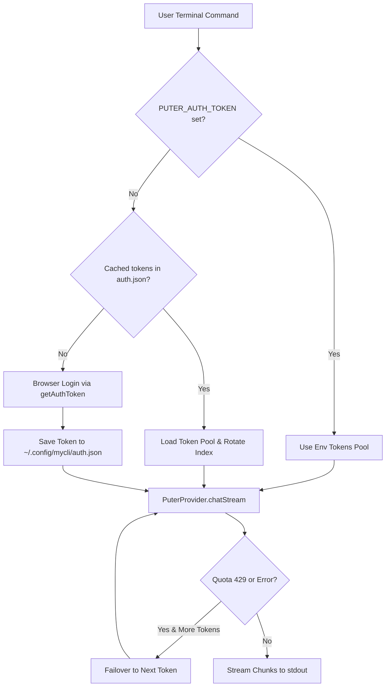

# puter-ai-cli

<div align="center">

### Free CLI AI Assistant Powered by Puter.js

[](LICENSE)
[](https://nodejs.org/)
[](https://www.typescriptlang.org/)
[](https://github.com/MishraShardendu22/puter-ai-cli/actions)
[](https://github.com/MishraShardendu22/puter-ai-cli)

<p align="center">
  <b>Stream GPT-4o, GPT-5.4, Claude 3.5 & more directly in your terminal without requiring an OpenAI API key or paid subscription.</b>
</p>

</div>

---

## Why `puter-ai-cli`?

Most AI command-line tools require an expensive OpenAI or Anthropic API key with upfront billing. **`puter-ai-cli`** integrates with **Puter.js** to provide free, serverless AI queries directly from your terminal.

- **Zero OpenAI API Key Required**: Powered entirely by Puter's hosted AI infrastructure.
- **Real-Time Token Streaming**: Watch responses stream into `stdout` token-by-token.
- **One-Click Browser Auth**: Automatically opens your browser on first run and persists your session securely.
- **Multi-Token Pooling & Auto-Failover**: Configure multiple Puter accounts; the CLI automatically rotates between them (Round-Robin) and fails over seamlessly if one hits a rate limit!
- **Unix Pipeline Native**: Pipe files, git diffs, and logs directly into prompts (`cat file.c | mycli ask`).
- **Production-Grade**: Written in TypeScript with strict typing, comprehensive error normalization, and non-zero exit codes.

---

## Quickstart

### 1. Installation

Clone and install dependencies:

```bash
git clone https://github.com/MishraShardendu22/puter-ai-cli.git
cd puter-ai-cli
npm install
npm run build
npm link
```

### 2. First Run (Automatic Login)

Ask any prompt. On first run, it will automatically launch your browser to log in to Puter:

```bash
mycli ask "Explain epoll in simple terms."
```

Once logged in, credentials are saved securely to `~/.config/mycli/auth.json` (mode `0600`). Subsequent runs execute immediately with zero prompts!

---

## CLI Usage & Examples

### Ask Queries Directly

```bash
# Standard question
mycli ask "Explain epoll."

# Quotation marks are optional for multi-word queries
mycli ask What is the difference between TCP and UDP?
```

### Route to Different AI Models

Pass `-m` or `--model` to route prompts to top-tier models:

```bash
# GPT-4o
mycli ask "Explain the actor model." -m gpt-4o

# GPT-5.4 (Most powerful reasoning)
mycli ask "Design an LSM-tree storage engine." -m gpt-5.4

# GPT-5.3 Codex (Specialized for code)
mycli ask "Write an epoll-based reactor loop in C." -m gpt-5.3-codex

# Claude 3.5 Sonnet
mycli ask "Analyze this architecture for bottlenecks." -m claude-3-5-sonnet
```

### Pipe Stdin Input

Pipe logs, source files, or git diffs straight into `mycli ask`:

```bash
# Code review
cat main.c | mycli ask "Review this C code for memory leaks and buffer overflows."

# Automated Git commit message generation
git diff | mycli ask "Generate a conventional commit message for these changes."

# Log file analysis
tail -n 100 /var/log/syslog | mycli ask "Identify any recurring errors in this log."
```

### Control Output & Temperature

```bash
# Disable streaming and print full response at once
mycli ask "List 5 SOLID design principles." --no-stream

# Adjust temperature for creative brainstorming (0.0 to 2.0)
mycli ask "Suggest 3 unique names for a vector database." -t 0.9
```

---

## Token Pool & Round-Robin Rotation

Puter provides 1,000 free monthly credits per account. With `puter-ai-cli`, you can pool multiple accounts to multiply your free quota and enable automatic failover:

```bash
# Check current authentication and pool status
mycli auth status

# Add additional tokens to the pool
mycli auth add "your_second_token_here"

# List configured tokens in the rotation pool
mycli auth list

# Remove a token by index number
mycli auth remove 2
```

### How Rotation Works

1. **Round-Robin**: Each consecutive query automatically advances to the next token in the pool, distributing usage evenly across accounts.
2. **Auto-Failover**: If a token runs out of monthly credits (HTTP `429`), `mycli` **automatically retries the query with the next available token** in your pool!
3. **Multiplied Allowance**: 2 accounts = 2,000 free monthly credits; 5 accounts = 5,000 free monthly credits.

---

## CI & Headless Environments

In Docker containers, GitHub Actions, or SSH sessions without a GUI browser, set the `PUTER_AUTH_TOKEN` environment variable:

```bash
# Single token
export PUTER_AUTH_TOKEN="your_puter_auth_token"

# Comma-separated list for automatic rotation in CI
export PUTER_AUTH_TOKEN="token_1,token_2,token_3"

mycli ask "Explain epoll."
```

---

## CLI Reference

| Command / Option | Description |
|---|---|
| `mycli ask <prompt>` | Query Puter AI and stream the answer to stdout |
| `-m, --model <name>` | Specify model (e.g. `gpt-5-nano`, `gpt-4o`, `gpt-5.4`, `claude-3-5-sonnet`) |
| `-w, --web-search` | Enable real-time web search for live queries & citations (`--search`) |
| `--stream` | Stream tokens in real time (default: `true`) |
| `--no-stream` | Wait and output the complete response at once |
| `-t, --temperature <num>` | Sampling temperature between `0` and `2` |
| `mycli auth status` | Display active token, source, and pool size |
| `mycli auth add <token>` | Add a new token to the multi-account rotation pool |
| `mycli auth list` | List all tokens in pool and show active rotation index |
| `mycli auth remove <id>` | Remove a token by pool position |
| `mycli auth login` | Launch browser to authenticate and store a new token |
| `mycli auth logout` | Clear all cached tokens from disk |

---

## Architecture



---

## Testing

The project includes an automated test suite with 31 unit and integration tests:

```bash
# Run all tests
npm test

# Run build typecheck
npm run build
```

Coverage spans:
- Token persistence, restricted permissions (`0600`), and precedence hierarchy.
- Multi-token pooling, round-robin rotation, and quota failover.
- Puter provider response extraction and streaming iterator fallback.
- CLI argument parsing, stdin piping, and exit codes.

---

## Contributing

Contributions are warmly welcomed! Please read our [Contributing Guide](CONTRIBUTING.md) and [Code of Conduct](CODE_OF_CONDUCT.md).

---

## License

This project is licensed under the [MIT License](LICENSE).
