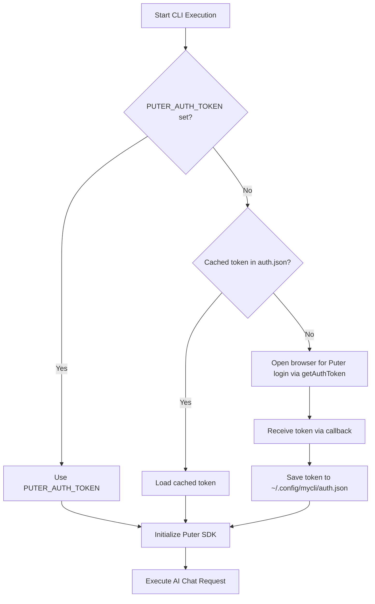

# Puter.js CLI AI Provider (`mycli`)

A production-grade command-line AI assistant powered by Puter.js. This CLI allows you to execute AI prompts directly from your terminal using Puter's serverless AI infrastructure—**without requiring an OpenAI API key**.

---

## Features

- **No OpenAI API Key Required**: Leverages Puter's hosted AI models directly via `@heyputer/puter.js`.
- **Seamless Browser Authentication**: On first run, prompts for Puter login via `getAuthToken()` in your default browser.
- **Secure Token Persistence**: Caches credentials securely in `~/.config/mycli/auth.json` with restricted `0600` permissions so subsequent runs require no login.
- **Headless & CI Support**: Overrides authentication seamlessly via the `PUTER_AUTH_TOKEN` environment variable for automated pipelines and remote servers.
- **Streaming by Default**: Streams responses token-by-token in real time to standard output.
- **Piped Stdin Support**: Accept prompts directly from standard input (e.g. `cat file.txt | mycli ask`).
- **Production-Grade Error Handling**: Clean error output to `stderr` with actionable messages and strict non-zero exit codes.

---

## Project Structure

```
├── src/
│   ├── index.ts           # CLI entrypoint with Commander & warning suppression
│   ├── auth.ts            # Token resolution, browser auth & persistence
│   ├── commands/
│   │   └── ask.ts         # 'ask' CLI command with streaming & stdin support
│   └── providers/
│       └── puter.ts       # Puter AI provider implementation & error mapping
├── tests/
│   ├── auth.test.ts       # Unit tests for token persistence & precedence
│   ├── puter.test.ts      # Unit tests for Puter provider & streaming parser
│   └── cli.test.ts        # Integration tests for CLI commands & exit codes
├── dist/                  # Compiled JavaScript distribution
├── package.json
└── tsconfig.json
```

---

## Prerequisites

- **Node.js**: v24.0.0 or later (v24.19.0 recommended)
- **npm**: v10.0.0 or later

---

## Installation & Setup

1. **Install dependencies**:
   ```bash
   npm install
   ```

2. **Build the TypeScript source**:
   ```bash
   npm run build
   ```

3. **Link globally (optional, to use `mycli` anywhere)**:
   ```bash
   npm link
   ```

After linking, the `mycli` executable is available globally in your PATH.

---

## Authentication Flow

The CLI follows a deterministic 3-tier authentication precedence:



### 1. First Run (Interactive Browser Login)
When running `mycli ask` for the first time without a cached token or environment variable:
1. The CLI calls `getAuthToken()` from `@heyputer/puter.js`.
2. A temporary local HTTP callback server is started and your default browser opens the Puter login page (`https://puter.com/?action=authme`).
3. If running over SSH or if the browser fails to open, a manual login URL is printed to `stderr`.
4. Upon authentication, Puter redirects back to the local listener.
5. The token is securely stored at `~/.config/mycli/auth.json` (mode `0600`).
6. The CLI proceeds with answering your prompt.

### 2. Subsequent Runs (Automatic Reuse)
Future invocations automatically detect and load the cached token from disk, with zero authentication prompts.

### 3. CI / Headless Environments (`PUTER_AUTH_TOKEN`)
In headless environments, GitHub Actions, Docker containers, or remote servers without a GUI display, set the `PUTER_AUTH_TOKEN` environment variable:

```bash
export PUTER_AUTH_TOKEN="your_puter_auth_token_here"
mycli ask "Explain epoll."
```

When `PUTER_AUTH_TOKEN` is present, it bypasses browser authentication and disk cache checks entirely.

---

## CLI Usage

### Basic Usage

Ask any question to Puter AI:

```bash
mycli ask "Explain epoll."
```

Arguments with multiple words can be passed with or without quotation marks:

```bash
mycli ask Explain the difference between select, poll, and epoll.
```

### Piping Input from Stdin

Pipe files, git diffs, or commands into `mycli ask`:

```bash
cat main.c | mycli ask "Review this code for buffer overflows and memory leaks."
```

```bash
git diff | mycli ask "Generate a conventional commit message for these changes."
```

### Specifying AI Models

Use `-m` or `--model` to route queries to a specific model supported by Puter:

```bash
mycli ask "Write a quicksort implementation in Rust." --model gpt-5-nano
```

```bash
mycli ask "Refactor this function." --model claude-3-5-sonnet
```

### Streaming Control

Streaming is enabled by default. To disable streaming and wait for the complete response:

```bash
mycli ask "List 5 design patterns." --no-stream
```

### Sampling Temperature

Tune model randomness using `-t` or `--temperature` (between `0` and `2`):

```bash
mycli ask "Suggest 3 creative names for an open source database." -t 0.9
```

---

## Token Pool, Round-Robin Rotation & Auto-Failover

You can configure multiple Puter accounts/tokens. The CLI will:
1. **Rotate automatically** (Round-Robin) between tokens on each prompt to balance usage evenly.
2. **Auto-Failover**: If a token hits a 429 (quota or rate-limit) error, `mycli` will automatically fail over to the next available token in your pool without failing your query!
3. **Multiply your free allowance**: 3 tokens = 3,000 free monthly credits; 5 tokens = 5,000 free monthly credits.

### Add Tokens to the Pool
```bash
mycli auth add "your_second_puter_token"
```

### View Configured Tokens & Active Rotation Position
```bash
mycli auth list
```
Output:
```text
--- Configured Puter Tokens (2 total) ---
  1. eyJh...IXy4 (active next)
  2. eyJh...K3z9
```

### Remove a Token from the Pool
```bash
# Remove by number (e.g., token 2)
mycli auth remove 2
```

### Environment Variable Rotation
You can also supply multiple tokens via `PUTER_AUTH_TOKEN` separated by commas:
```bash
export PUTER_AUTH_TOKEN="token_1,token_2,token_3"
```

---

## Authentication Management Commands

The CLI includes dedicated commands to inspect and manage your stored credentials:

### Check Authentication Status
```bash
mycli auth status
```
Output:
```text
--- Puter Authentication Status ---
Active Source: Cached credentials file
Token Pool:    2 token(s) configured (Round-Robin enabled)
Active Token:  [1/2] eyJh...IXy4
Storage Path:  /home/user/.config/mycli/auth.json
```

### Explicit Browser Login
```bash
mycli auth login
```

### Logout / Clear Cached Credentials
```bash
mycli auth logout
```
Output:
```text
Removed all cached credentials at: /home/user/.config/mycli/auth.json
```

---

## Error Handling & Exit Codes

The CLI strictly respects Unix process exit codes:

| Exit Code | Cause |
|---|---|
| `0` | Success: prompt answered and completed cleanly |
| `1` | Failure: missing prompt, invalid token (401), rate limits (429), or network error |

Errors are written to standard error (`stderr`), ensuring they do not pollute piped standard output (`stdout`).

---

## Running Tests

Run the full automated test suite (27 unit and integration tests):

```bash
npm test
```

Test coverage includes:
- **`tests/auth.test.ts`**: Token persistence, file mode security (`0600`), precedence hierarchy (`PUTER_AUTH_TOKEN` > cached > browser), and headless detection.
- **`tests/puter.test.ts`**: Puter provider initialization, response content extraction, stream chunk parsing, and async generator fallback.
- **`tests/cli.test.ts`**: End-to-end CLI integration testing `--version`, `--help`, `auth status`, `ask` with stdin piping, and error exit codes.
